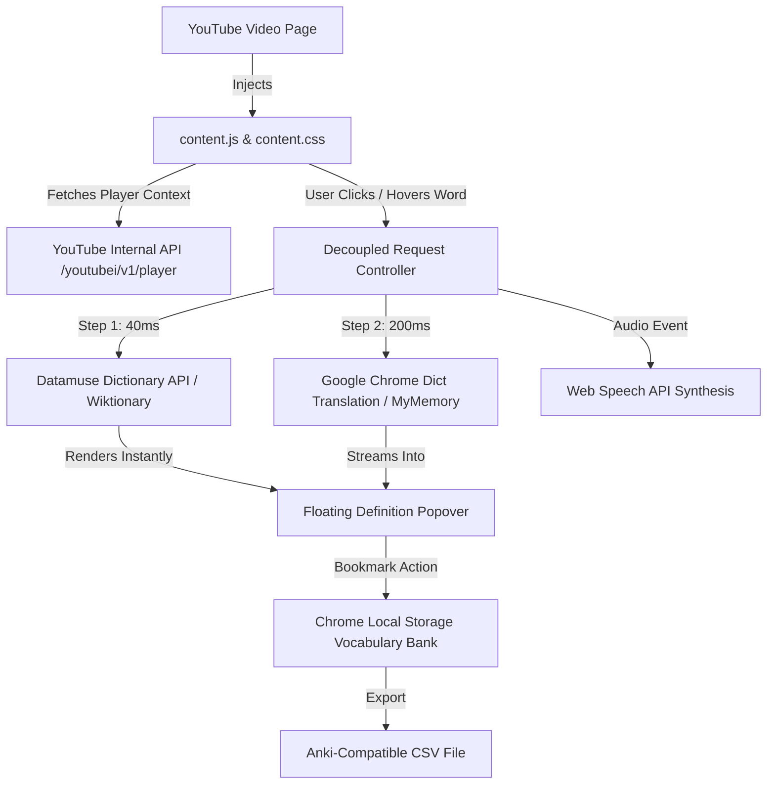

# 🎓 Captionary

<p align="center">
  
</p>

<p align="center">
  <b>Interactive YouTube Video Transcript & Instant Vocabulary Companion for Language Learners</b>
</p>

<p align="center">
  <a href="#-features"></a>
  <a href="LICENSE"></a>
  <a href="#-supported-languages"></a>
  <a href="CONTRIBUTING.md"></a>
  <a href="#-technical-architecture"></a>
</p>

---

## 🌟 Overview

**Captionary** transforms YouTube into an interactive language-learning powerhouse. Designed specifically for ESL learners, polyglots, and curious minds, Captionary places a native-styled, synchronized transcript right next to your YouTube video. 

Every single word in the transcript is interactive—simply click or hover over any word to instantly reveal its **English definition**, **IPA phonetic guide**, **audio pronunciation**, and **translation into your native language**, without ever pausing or disrupting your video.

---

## ⚡ Key Features

### 1. 📜 Synchronized Interactive Transcript Panel
- Seamlessly mounts at the top of YouTube's right column (`#secondary`), blending indistinguishably into YouTube's native UI.
- Pixel-perfect support for both **YouTube Dark Mode** (`#0f0f0f`) and **Light Mode** (`#ffffff`).
- Automatically extracts captions directly from YouTube's internal player data (supports both manual subtitles and auto-generated captions).
- Multi-track selector allows instant switching between available caption languages.

### 2. ⚡ Blazing-Fast Two-Phase Word Lookup (<50ms)
- **Phase 1 (Instant English Meaning):** When you click a word, its dictionary definition, part of speech, and IPA phonetic transcription appear in **~40–70ms** (or **0ms** when cached).
- **Phase 2 (Streaming Native Translation):** Your native translation (e.g. Hindi, Spanish, French, German, Japanese, etc.) streams into a non-blocking translation pill without freezing the definition.
- **Smart Hover Prefetching:** Hovering over any word in the transcript for >90ms preloads its definition and translation into memory. When you click, the popup opens with **zero delay (0ms)**.

### 3. 🔊 Native Audio Pronunciation & Phonetics
- Listen to crystal-clear pronunciations with the built-in **🔊 Listen** button.
- Powered by high-fidelity native recordings with automatic fallback to the **Web Speech API**.
- Includes complete **IPA phonetics** (e.g. `/ˈpleʒ.ər/`) for accurate pronunciation.

### 4. 🎯 Video-Synchronized Playback (Auto-Scroll)
- Highlights the current spoken sentence in real-time with an animated accent border as the video plays.
- Clicking any timestamp badge (e.g., `01:45`) jumps the video to that exact second.
- Smart auto-scroll keeps the current line visible, automatically pausing if you scroll manually to read ahead.

### 5. ⭐ Vocabulary Bank & Anki / Quizlet Export
- Star any word with the **☆ Bookmark** button to save it directly into your personal Word Bank.
- Each saved word records the video title and exact timestamp so you can jump back to the exact context in which you encountered it.
- **1-Click CSV Export:** Export your entire vocabulary bank into a formatted `.csv` ready for import into **Anki**, **Quizlet**, or spreadsheets.

### 6. 🔍 Real-Time Transcript Search & Filter
- Search through the entire video transcript in real-time.
- Highlights matching keywords instantly with glowing markers.

---

## 🖼️ UI & User Experience

```text
┌──────────────────────────────────────────────────────────────┐
│  Captionary                   [ Auto-Scroll: ON ]  [ ✕ ]    │
├──────────────────────────────────────────────────────────────┤
│  [ Transcript ]  [ ★ Words (12) ]   [ Translate: Hindi ⌄ ]   │
│  [ English (auto) ⌄ ]                                        │
├──────────────────────────────────────────────────────────────┤
│  0:17  and when I was telling her I wanted                   │
│  0:17  to go to LA and study film                            │
│  0:19  and make videos for musicians                         │
│                                                              │
│       ┌──────────────────────────────────────────────┐       │
│       │ telling                                  [✕] │       │
│       │ /ˈtɛlɪŋ/    [🔊]  [☆]  [📋]                  │       │
│       │ 🌐 HINDI: कह / बताना                         │       │
│       ├──────────────────────────────────────────────┤       │
│       │ ADJECTIVE                                    │       │
│       │ 1. Revealing information; significant.       │       │
│       │ NOUN                                         │       │
│       │ 2. The act of narration or disclosure.       │       │
│       │                               Wiktionary ↗   │       │
│       └──────────────────────────────────────────────┘       │
│                                                              │
│  0:23  she said, "people like us don't make it like that"    │
└──────────────────────────────────────────────────────────────┘
```

---

## 🚀 Installation Guide

### Option A: Install from Source (Developer Mode)

1. **Clone the repository**:
   ```bash
   git clone git@github.com:deepakvasuchoudhary/Captionary.git
   cd Captionary
   ```
2. **Open Google Chrome** and navigate to:
   ```
   chrome://extensions/
   ```
3. Toggle on **Developer mode** in the top-right corner.
4. Click the **"Load unpacked"** button in the top-left corner.
5. Select the `Captionary` repository folder.
6. That's it! Captionary is now active on YouTube.

---

## 🎯 How to Use

1. Navigate to any YouTube video (e.g., [TED Talk](https://www.youtube.com/watch?v=8KkKuTCFvzI) or [Lex Fridman Podcast](https://www.youtube.com/watch?v=jvqFAi7vkBc)).
2. Look at YouTube's right column (above recommended videos)—the **Captionary** transcript panel loads automatically.
3. Click any word in the transcript to open the definition & translation popover.
4. Click **🔊** to hear it spoken, or **☆** to save it to your Word Bank.
5. Switch to the **★ Words** tab to view your saved vocabulary or export to Anki.
6. Use the **Translate** dropdown to pick your preferred target language.

---

## 🌐 Supported Languages

Captionary translates words between any language pair with optimized presets for:

| Language | Code | Native Name |
| :--- | :--- | :--- |
| **English** | `en` | English |
| **Hindi** | `hi` | हिन्दी |
| **Spanish** | `es` | Español |
| **French** | `fr` | Français |
| **German** | `de` | Deutsch |
| **Chinese (Simplified)** | `zh` | 中文 (简体) |
| **Japanese** | `ja` | 日本語 |
| **Arabic** | `ar` | العربية |
| **Russian** | `ru` | Русский |
| **Portuguese** | `pt` | Português |

---

## 🛠 Technical Architecture



- **Zero External Bundles:** Built entirely with pure, vanilla JavaScript and CSS for maximum speed and zero memory bloat.
- **Manifest V3 Compliant:** Employs modern background service worker architecture with ephemeral lifecycle management.
- **YouTube Internal Player Extraction:** Same-origin direct extraction of timed caption segments without relying on third-party scrapers or external rate limits.

---

## 📁 Repository Structure

```
Captionary/
├── manifest.json         # Extension Manifest V3 configuration
├── content.js            # YouTube DOM injection & transcript controller
├── content.css           # Native YouTube Dark/Light theme styles
├── background.js         # Service worker: dictionaries & multi-tier translation
├── popup/
│   ├── popup.html        # Settings & Vocabulary management popup
│   ├── popup.css         # Modern sleek styling for settings
│   └── popup.js          # Options persistence & Anki CSV exporter
├── icons/
│   ├── icon16.png        # Toolbar icon (16x16)
│   ├── icon32.png        # Toolbar icon (32x32)
│   ├── icon48.png        # Extension management icon (48x48)
│   └── icon128.png       # Chrome Web Store & Store display icon (128x128)
├── LICENSE               # MIT License
├── CONTRIBUTING.md       # Contribution guidelines
└── README.md             # Project documentation
```

---

## 🤝 Contributing

Contributions are warmly welcomed! Please check out [CONTRIBUTING.md](CONTRIBUTING.md) for details on code style, branch workflows, and submitting pull requests.

---

## 📄 License

This project is licensed under the [MIT License](LICENSE) © 2026 Deepak Choudhary.
